# 1. HabHub Introduction

Link: http://predict.habhub.org/ 

For this tutorial, we will be using Habhub for burst calculation and landing estimation from a designated starting coordinate.

NOTE: Habhub can only perform predictions of up to 180 Hours into the future. This equates to 7.5 days 

# 2. Getting Started 

## 2.1 Unit conversion

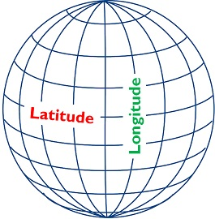

Habhub uses the decimal system for its longitude and latitude. Hence the lat and long must be converted from the Northings and Eastings format to a signed Lat and Long format. It is important to know the difference between Lat and Long (Figure 1 retrieved from https://keydifferences.com/difference-between-latitude-and-longitude.html)

Example: Allambie Airport's coordinates are 24.2667oS and 134.4oE which are the Latitude and Longitude respectively. Converting to a signed format means that it is <a name="sign">-24.2667 and 134.4</a>

## 2.1 Saving a location

Upon Starting Habhub for the first time, there will be a default location set at Churchill, UK. For this tutorial, we will be setting saving Allambie Airport as the starting location. 

- Set the Launch Site to "Other"
- Input the Lat and Long in Signed format [signed format](#sign)
- Click "Save Location"

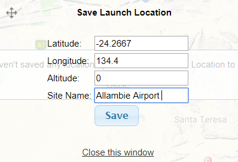

- Under "Site Name", key in the desired name and click "Save"

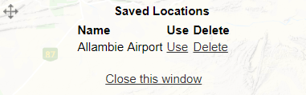

- Verify that it has been saved by clicking on "Custom", the name of the Saved location should be displayed

# 3. Prediction and Verification 

## 3.1 Performing a prediction

Key in the values as per the text fields. This only requires information about the flight depending on the balloon used.

Note: Timing Considerations (The time is in UTC). 

- Singapore is 8 hours ahead of UTC. 
- Alice Springs is 9.5 hours ahead of UTC timing 
- Hence, if the launch at Alice Springs is 0600 on 24 Jan 2019, the time we set on Habhub is 20:30 on 23 Jan 2019

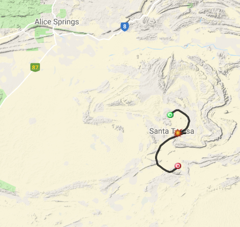

- This brings up a 2D flight path drawn on a map/ Mouse over the dots till the cursor changes to see the coordinates of each point 

  
  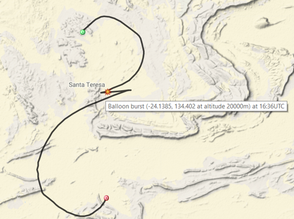

  1. Red dot: Starting location
  2. Orange dot: Burst location 
  3. Green dot: Landing location

## 3.2 Verify the prediction - Windy.com

Link: https://www.windy.com/

Follow the link to go to a website that shows the wind directions at different altitudes. This will show where the balloon is expected to blow towards. From the flight path. we expect the wind to blow in a North-West direction. In ASP time, windy is **refreshed at 0445 and 1745.**

Steps

1. Search for Alice Springs. We do this because Windy does not have a specific location for Allambie Airport.
   
2. This will bring us to Alice Springs on the map
   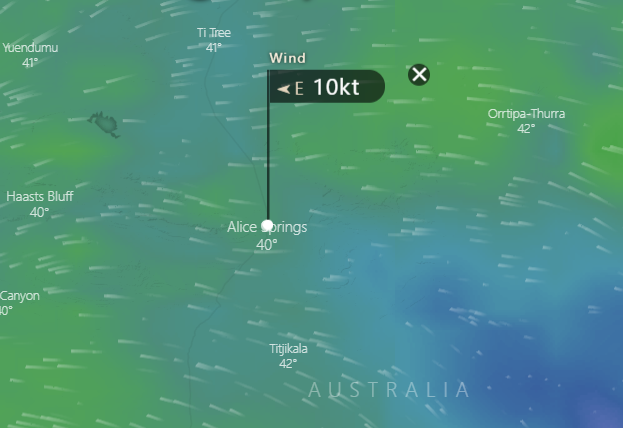
3. Since we want to set the point as Allambie airport, we have to click on the location in the map which is not present. Hence, to improve accuracy, zoom in
   
4. Once zoomed in, click on the estimate position of Allambie Airport
   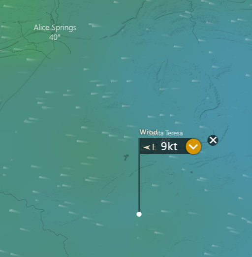
5. Then set the date to the date of the flight prediction and slide the bar to get the time.
   
6. By default, the slider for altitude is set to "Surface". Seeing the pattern tallies with the flight path since the balloon heads South West first 

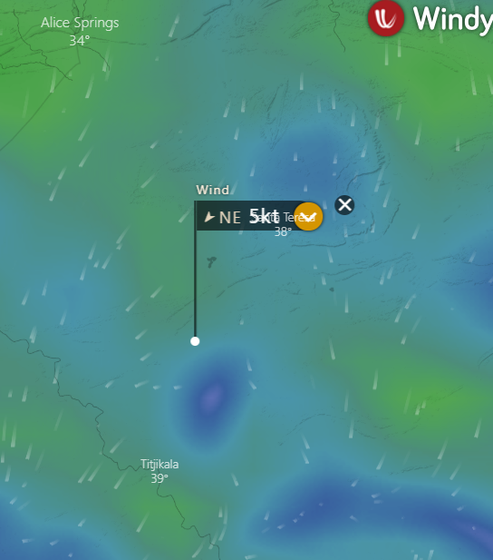
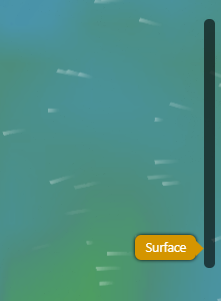

7. We also know that after the burst it heads roughly North East. However, Windy cannot verify this because its maximum altitude is 13.5 km whereas the burst altitude is 20km. 

# 4. 3D flight path  - Google Earth

Download Link to Google Earth Pro: https://www.google.com/earth/versions/#earth-pro

**<u>Steps</u>**

1. In Habhub, after the prediction is run, save the path as a KML file. This is found under Scenario information at the top right hand corner 

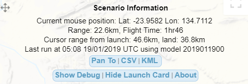

2. Open Google Earth Pro and notice that the fie structure on the left 

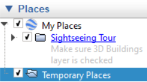

3. Locate the file in the file explorer and open it in Google Earth by dragging it in to the map UI. The cursor should say "Copy". Notice that the file structure has the flight path 

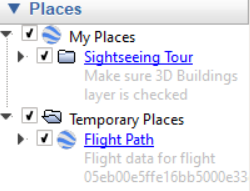

4. This will open the flight path. It is advissable to use a mouse to rotate and view the path from different angles 
   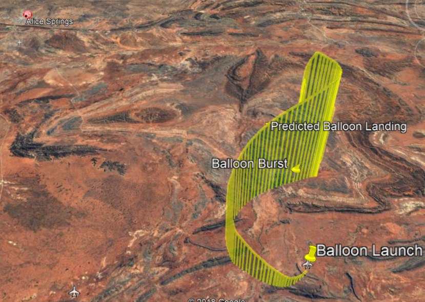
   - Left mouse click drags about that anchor point 
   - Holding scroll rotates the camera angle 
   - Scroll in and out to adjust the zoom 
5. Clicking the pins shows details about that particular location 
   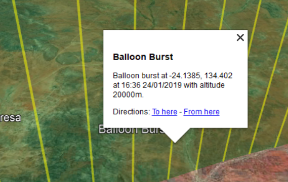

# 5. Overlaying maps - Google Earth

Steps

1. Find the pre-prepared file with the safe landing zones and overlay it in Google Earth 
2. Look at the Landing pin and make sure that it is within the regions that are marked out as safe 

