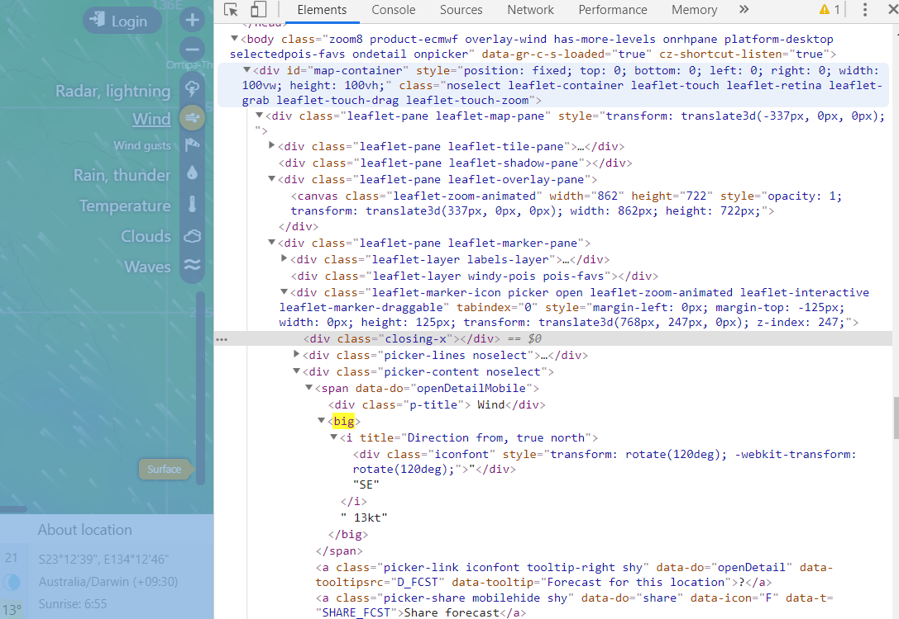

# 1. Chrome Driver

The chrome driver version used is for Chrome Version 74 Windows 32 bit computer: <https://chromedriver.storage.googleapis.com/index.html?path=74.0.3729.6/>

# 2. Understanding Windy URL

## 2.1 Vary Parameter TIME

### 2.1.1 Data

UTC time is 8 hours behind Singapore time. If Singapore is 1500, they are 0700

Time now is 11 May 1500 (11-06). Date needed only on 12 May 1000 (12-03).  (This is 19 hours apart). On the 18th hour still don't need 

Time now is 11 May 1600 (11-09). Date needed only on 12 May 1000 (12-03).  (This is 19 hours apart). On the 18th hour still don't need (12 May 0900)

**<u>TIME</u>**

| Date and Time      | Link                                                         | Category |
| ------------------ | ------------------------------------------------------------ | -------- |
| 12 May Sunday 1800 | <https://www.windy.com/?2019-05-12-09,-24.495,133.907,8,m:cZiajSl> | 12-09    |
| 12 May Sunday 1900 | <https://www.windy.com/?2019-05-12-12,-24.495,133.907,8,m:cZiajSl> | 12-12    |
| 12 May Sunday 2000 | <https://www.windy.com/?2019-05-12-12,-24.495,133.907,8,m:cZiajSl> |          |
| 12 May Sunday 2100 | <https://www.windy.com/?2019-05-12-12,-24.495,133.907,8,m:cZiajSl> |          |
| 12 May Sunday 2200 | <https://www.windy.com/?2019-05-12-15,-24.495,133.907,8,m:cZiajSl> | 12-15    |
| 12 May Sunday 2300 | <https://www.windy.com/?2019-05-12-15,-24.495,133.907,8,m:cZiajSl> |          |
| 13 May Monday 0000 | <https://www.windy.com/?2019-05-12-15,-24.495,133.907,8,m:cZiajSl> |          |
| 13 May Monday 0100 | <https://www.windy.com/?2019-05-12-18,-24.495,133.907,8,m:cZiajSl> | 12-18    |
| 13 May Monday 0200 | <https://www.windy.com/?2019-05-12-18,-24.495,133.907,8,m:cZiajSl> |          |
| 13 May Monday 0300 | <https://www.windy.com/?2019-05-12-18,-24.495,133.907,8,m:cZiajSl> |          |
| 13 May Monday 0400 | <https://www.windy.com/?2019-05-12-21,-24.495,133.907,8,m:cZiajSl> | 12-21    |
| 13 May Monday 0500 | <https://www.windy.com/?2019-05-12-21,-24.495,133.907,8,m:cZiajSl> |          |
| 13 May Monday 0600 | <https://www.windy.com/?2019-05-12-21,-24.495,133.907,8,m:cZiajSl> |          |
| 13 May Monday 0700 | <https://www.windy.com/?2019-05-13-00,-24.495,133.907,8,m:cZiajSl> | 13-00    |
| 13 May Monday 0800 |                                                              |          |
| 13 May Monday 0900 |                                                              |          |
| 13 May Monday 1000 | <https://www.windy.com/?2019-05-13-03,-24.495,133.907,8,m:cZiajSl> | 13-03    |
| 13 May Monday 1100 |                                                              |          |
| 13 May Monday 1200 |                                                              |          |
| 13 May Monday 1300 | <https://www.windy.com/?2019-05-13-06,-24.495,133.907,8,m:cZiajSl> | 13-06    |
| 13 May Monday 1400 |                                                              |          |
| 13 May Monday 1500 | <https://www.windy.com/?2019-05-13-06,-24.495,133.907,8,m:cZiajSl> |          |
| 13 May Monday 1600 |                                                              | 13-09    |
| 13 May Monday 1700 | <https://www.windy.com/?2019-05-13-09,-24.495,133.907,8,m:cZiajSl> |          |
| 13 May Monday 1800 |                                                              |          |
| 13 May Monday 1900 |                                                              | 13-12    |
| 13 May Monday 2000 |                                                              |          |
| 13 May Monday 2100 |                                                              |          |
| 13 May Monday 2200 |                                                              | 13-15    |
| 13 May Monday 2300 |                                                              |          |

**<u>DATE</u>**


### 2.1.2 Analysis

The key part to the URL is `2019-05-06-15` which is year-month-day-time

In this case since we are only interested in certain windows, we simplify the problem to 

| Time      | Value    |
| --------- | -------- |
| 0500-0700 | day-1/21 |
| 0800-1000 | day/00   |
| 1100-1300 | day/03   |
| 1400-1600 | day/06   |
| 1700-1900 | day/09   |
| 2000-2200 | day/12   |
| 2300-0100 | day/15   |
| 0200-0400 | day/18   |

Note: From the current time to +15 (Inclusive) there is no date in the URL

## 2.2 Vary the parameter Altitude

We choose the time as 6 May 2019 Monday 0600

Surface: <https://www.windy.com/-23.928/133.906?2019-05-05-21,-24.497,133.907,8,m:cZiajSl>

100m: <https://www.windy.com/-23.928/133.906?100m,2019-05-05-21,-24.497,133.907,8,m:cZiajSl>

600m: <https://www.windy.com/-23.928/133.906?950h,2019-05-05-21,-24.497,133.907,8,m:cZiajSl>

750m: <https://www.windy.com/-23.928/133.906?925h,2019-05-05-21,-24.497,133.907,8,m:cZiajSl>

900m: <https://www.windy.com/-23.928/133.906?900h,2019-05-05-21,-24.497,133.907,8,m:cZiajSl>

1500m: <https://www.windy.com/?850h,2019-05-05-21,-24.497,133.907,8,m:cZiajSl>

2000m: <https://www.windy.com/?800h,2019-05-05-21,-24.497,133.907,8,m:cZiajSl>

3000m: <https://www.windy.com/?700h,2019-05-05-21,-24.497,133.907,8,m:cZiajSl>

4200m: <https://www.windy.com/?600h,2019-05-05-21,-24.581,133.902,8,m:cZiajSl>

5500m: <https://www.windy.com/?500h,2019-05-05-21,-24.581,133.902,8,m:cZiajSl>

7000m: <https://www.windy.com/?400h,2019-05-05-21,-24.413,134.034,8,m:cZiajSl>

9000m: <https://www.windy.com/?300h,2019-05-05-21,-24.413,134.034,8,m:cZiajSl>

10km: <https://www.windy.com/?250h,2019-05-05-21,-24.413,134.034,8,m:cZiajSl>

11.7km: <https://www.windy.com/?200h,2019-05-05-21,-24.413,134.034,8,m:cZiajSl>

13.5km: <https://www.windy.com/?150h,2019-05-05-21,-24.413,134.034,8,m:cZiajSl>


# 3. Retrieving values



```python
from selenium import webdriver
from selenium.webdriver.common.by import By

driver = webdriver.Chrome("chromedriver.exe")

# If the page does not respond within the timelimit, it will throw an error
driver.set_page_load_timeout(30)

# Note that the http in front is important
driver.get("https://www.windy.com/-23.928/133.906?2019-05-06-15,-24.649,133.648,8,m:cZiajSl")
#driver.maximize_window()

# Set a wait time for every element (In seconds)
driver.implicitly_wait(20)

c = driver.find_element_by_xpath("//*[@id='map-container']/div[1]/div[4]/div[4]/div[3]/span/big")
print(c.text)

driver.quit()
```

